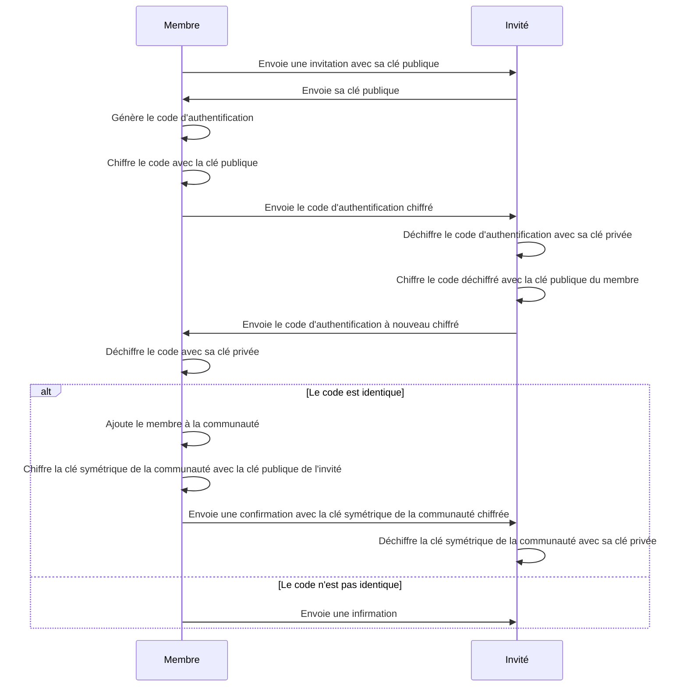

# Documentation sur #22

Afin d'ajouter un membre à une communauté, il est nécessaire que :
- une machine puisse envoyer et recevoir des messages d'une autre machine ;
- le système puisse chiffrer et déchiffrer des informations ;
- le système puisse générer des codes d'authentification.

## Communication entre machines
En amont de ce développement, un prototype a été réalisé afin de tester la communication entre machines. Ce prototype nous a permis de mettre en place l'utilisation de la librairie `socket` qui permet d'envoyer et de recevoir des messages entre machines. Pour faire communiquer celles-ci, il est nécessaire d'utiliser leur adresse ip et leur port de contact.  
Afin de faire communiquer deux machines, il est nécessaire que chacune d'elles ait au moins deux sockets : un ou plusieurs pour envoyer et recevoir des messages et un pour recevoir des messages imprévus. Ceux, pour envoyer et recevoir des messages, sont appelés `client`. C'est eux qui initient la communication avec l'autre machine. L'autre socket est appelé `server`. Son rôle est de réceptionner tous les messages non attendus par le client.

## Chiffrement et déchiffrement
Afin de garantir la confidentialité des messages, il est nécessaire de les chiffrer avant de les envoyer et de les déchiffrer lors de leur réception. Pour cela, nous utilisons un chiffrement symétrique. En effet, ce type de chiffrement permet d'utiliser la même clé pour chiffrer et déchiffrer un message. Il permet également d'utiliser la même clé pour tous les membres d'une communauté. Pour ce chiffrement, nous utilisons l'algorithme `AES`.  
Lors de l'invitation d'un membre à une communauté, les machines communiquent des données plus sensibles comme le code d'authentification du nouveau membre ou la clé de chiffrement symétrique de la communauté. Pour garantir la confidentialité de ces données, nous utilisons un chiffrement asymétrique. Ce type de chiffrement nécessite d'utiliser une clé publique pour chiffrer un message et une clé privée pour le déchiffrer. Ainsi, la clé privée est connue uniquement par la machine qui l'a générée et la clé publique est transmise à l'autre machine. Cette paire de clé permet également de vérifier l'identité de l'autre machine. Pour le chiffrement asymétrique, nous utilisons l'algorithme `RSA`.  
Le choix des algorithmes de chiffrement a fait l'objet d'une analyse au début du projet.

## Génération de codes d'authentification
Au sein d'une communauté, chaque membre est identifié par un code d'authentification. Ce code est généré lors de l'ajout d'un membre à une communauté. Il est généré par le membre qui ajoute le nouveau membre à la communauté. Ce code est unique et est utilisé pour identifier un membre au sein d'une communauté. C'est le service `UuidGeneratorService` qui permet de générer ce code d'authentification. Ce service utilise la librairie `uuid` qui permet de générer des codes uuid uniques.

## Scénario des communications
Le scénario des communications à réaliser afin d'inviter un nouveau membre dans une communautés a été schématisé sous forme d'[un diagramme de séquence](./add_member_usecase_sequence.mermaid).

## Implémentation de la couche présentation
Lors de ce développement, une modification dans l'organisation des menus a été apportée. Auparavant, dans le menu principal, l'utilisateur avait le choix de consulter le contenu d'une communauté. Désormais, ce choix est remplacé par l'option de se connecter à une communauté. Cette dernière permet à l'utilisateur de choisir à quelle communauté il veut se connecter. Lorsqu'il en choisit une, il a le choix de consulter les idées et les prises de position de cette communauté ou d'ajouter un nouveau membre. S'il choisit d'ajouter un nouveau membre, il doit entrer l'adresse ip et le port de contact de la machine de l'invité.
