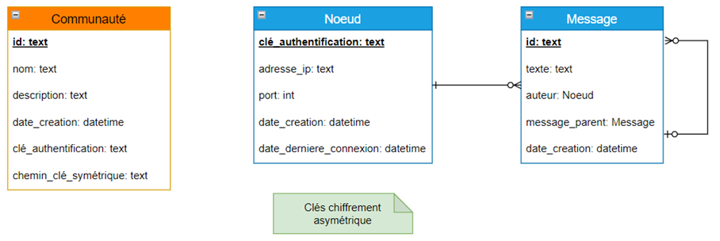

# Enregistrement des données

## Données à retenir

- **`Message`** *(correspond aux idées et prises de position)*
  - `id` (unique)
  - `texte`
  - `message parent` *(un message sans message parent est toujours une idée)*
  - `date de création`
  - `auteur` *(noeud - clé d'authentification)*

- **`Noeud`** *(correspond aux utilisateurs)*
  - `clé d'authentification` (unique) *(clé reçue lors de l'invitation à rejoindre le réseau)*
  - `adresse ip` et `port` de contact
  - `date de création`
  - `date de dernière connexion`
  - `clé publique` et `clé privée` de chiffrement

- **`Communauté`**
  - `id` (unique)
  - `name`
  - `description`
  - `clé symétrique` de chiffrement

## Choix de la technologie d'enregistrement

Après analyse des données à retenir, le choix d'utiliser une base de données (PostgreSql, MariaDB...) se trouve surdimensionné.
En effet, nous ne devons pas retenir une structure de données complexe et vouée à être modifiée.
Le choix donc se porte sur ***un enregistrement sur fichiers***.

Pour ce choix, plusieurs technologies :
- **Fichiers simples**
  - Gestion "à la main" des accès R/W sur les données. Cela implique une très grande rigourosité dans la gestion des accès aux fichiers, au risque de rendre toutes les données erronées.
  - Utilisation des accès fichiers pour accéder aux données.

- **SqLite**  ([Documentation](https://www.sqlite.org/index.html))
  - Gestion automatisée des accès R/W sur les données.
  - Utilisation de SQL pour accéder aux données.

Nous choisissons ***SqLite*** pour l'enregistrement des données grâce à sa simplicité d'utilisation et de gestion des fichiers.

## Choix de la structure de données
Pour enregistrer les données, nous faisons le choix de les répartir sur plusieurs fichiers. Cela permet de gérer plus facilement les données et la gestion des différentes communautés. Tous ces fichiers seront stockés dans un dossier spécifique à l'application. L'organisation des fichiers est représentée dans la figure ci-dessous.   
Tout d'abord, chaque utilisateur possède une paire de clé de chiffrement asymétrique. Nous allons enregistrer ces clés dans des fichiers spécifiques : la clé publique dans un fichier d'extension `.pub` et la clé privée dans un fichier sans extension. Ces fichiers sont représentés en vert dans l'illustration.   
Ensuite, un utilisateur peut avoir connaissance de plusieurs communauté. La liste de celles-ci est enregistrée dans un fichier SqLite nommé `index`, représenté en orange. Ce fichier contient une table `communities` qui contient les informations de chaque communauté :
- `id` : l'identifiant de la communauté
- `name` : le nom de la communauté
- `description` : la description de la communauté
- `creation_date` : la date de création de la communauté
- `encryption_key_path` : le chemin vers la clé de chiffrement symétrique de la communauté
- `auth_key` : le code d'authentification de l'utilisateur dans cette communauté

La clé symétrique de chiffrement de la communauté est enregistrée dans un fichier d'extension `.key` et est nommée par l'identifiant de la communauté à laquelle elle se rapporte. Toutes les clés symétrique des communautés se trouvent dans le dossier `keys`.   
Enfin, nous retenons les données de chaque communauté dans un fichier SqLite nommé par l'identifiant de la communauté. Cette partie est représentée en bleu dans l'image ci-dessous. Ce fichier contient deux tables : `messages` et `nodes`. La table `messages` contient les informations des idées et prises de position de la communauté :
- `id` : l'identifiant du message
- `author` : l'auteur du message, c'est-à-dire le code d'authentification de l'utilisateur
- `content` : le contenu du message
- `parent_message` : l'identifiant du message parent, c'est-à-dire l'idée ou la prise de position à laquelle le message répond
- `creation_date` : la date de création du message

La table `nodes` contient les informations des utilisateurs de la communauté :
- `auth_key` : le code d'authentification de l'utilisateur
- `ip_address` : l'adresse ip de l'utilisateur
- `port` : le port de l'utilisateur
- `creation_date` : la date de création de l'utilisateur
- `last_connection_date` : la date de dernière connexion de l'utilisateur

